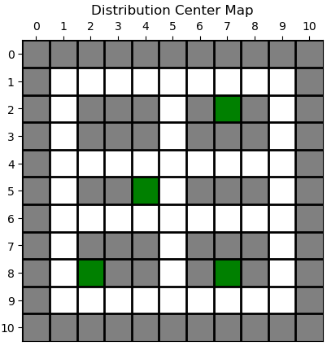
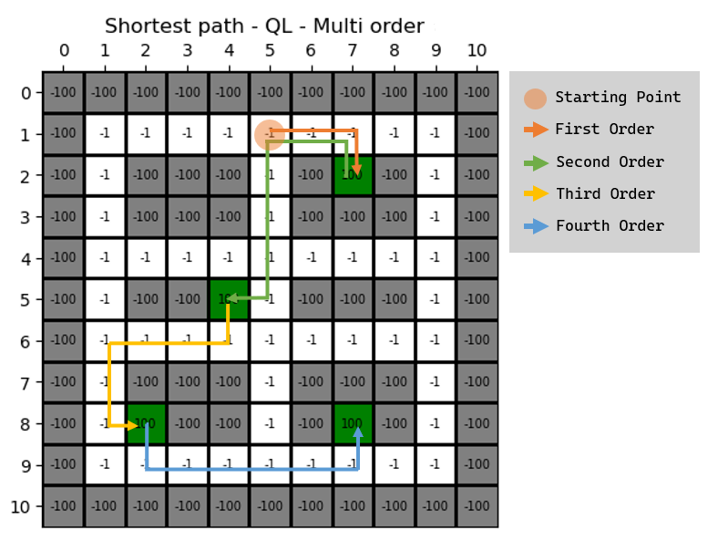
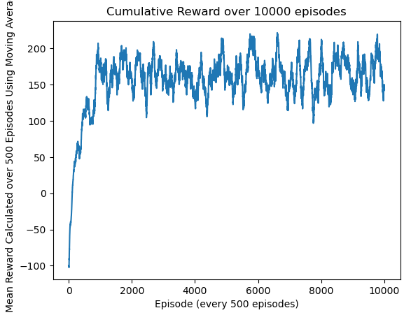
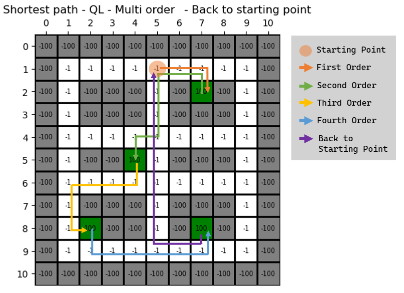

# Route Optimization for Order Picking in Distribution Centers using Reinforcement Learning based Genetic Algorithm

**B.Sc. Thesis Project, Summer 2023**

**SuperVisor:** Dr. Hossein Akbaripour

**Student:** Matineh Rangzan


## Introduction
Consider an e-commerce company has a distribution center, and the company would like all of the picking operations in the center to be performed by warehouse robots.
In the context of e-commerce warehousing, “picking” is the task of gathering individual items from various locations in the warehouse in order to fulfill customer orders.
We are trying to use Reinforcement Learning and Genetic Algorithm to optimize the path of the robot in a Distribution Center. The robot is trying to pick up the orders from the shelves and put them in the cart. The robot can move in four directions: `up, down, left, and right`. 
* The robot can only move one step at a time.
* The robot can only pick up one order at a time.
* The agent can only pick up the order if it is in the same cell as the order.

After picking the item from the shelves, the robot must bring the item to a specific location (starting point) within the warehouse where the items can be packaged for shipping.

In order to ensure maximum efficiency and productivity, the robot will need to learn the shortest path between the item packaging area and all other locations within the warehouse where the robot is allowed to travel.

Our ultimate goal is to find the optimal path by incorporating the `Genetic Algorithm` into the `Q-Learning` algorithm.

## Define the Environment
The environment is an `11x11` distribusiton cetner.
As right now there of 3 types of cells in the environment:
* `Orders`: The robot can move to these cells and pick up the order (**green squares**).
* `Aisles`: the robot can use them to travel throughout the warehouse (**white squares**).
* `Shelves`: The robot can not move to these cells and these locations are for storing items (**gray squares**).

    

## Stages of the Project

1. **Single Order Picking**

    1.1. **Q-Learning:**
    For single order picking, we used a simple `Q-Learning` algorithm to find the optimal path.

        Rewards:
        Order: We reward the agent with a positive reward if it picks up the order and we finish the episode.
        Aisles: We reward the agent with a meager negative reward when it passes through these cells.
        Shelves: The agent can not move to these cells and these locations are for storing items. We punish the agent with a negative reward if it tries to move to these cells, and then we finish the episode.

    [1-1-Q-Learning_Single-Order.ipynb](https://github.com/matinrnz/PathPlanning/blob/main/1-1-Q-Learning_Single-Order.ipynb)

    1.2. **Genetic Algorithm:**
    For single order picking, we used a simple `Genetic Algorithm` to find the optimal path.

    [1-2-Genetic-Algorithm_Single-Order.ipynb](https://github.com/matinrnz/PathPlanning/blob/main/1-2-Genetic-Algorithm_Single-Order.ipynb)

2. **Multi Order Picking**

        Rewards:
        Orders: We reward the agent with a positive reward if it picks up the order. We also remove the order from the environment. And after the counter of the orders reaches zero, we finish the episode.

    For multi order picking, we needed a multi dimensional `Q_Table` to store the values. Where we had an new `Q_Table` for each order.
    ```python
    q_values = np.zeros((NUM_ORDERS, 11, 11, 4))
    ```

    [2-1-Q-Learning_Mutli-Order.ipynb](https://github.com/matinrnz/PathPlanning/blob/main/2-1-Q-Learning_Mutli-Order.ipynb)

    

3. **Multi Order Picking and Returning to the Starting Point**
    
    The procedure is the same as Multi Order picking, but we add a `+1`` to the NUM_ORDERS, so we can add the starting point as the last point of the path. But here is the caviet: if we add the starting point right away, the agent will be confues to go to the starting point or to the next point. So we add the starting point only when the agent is in the last point of the path.
    ```python            
    if left_orders == 1:
        local_rewards[START[0], START[1]] = ORDER_REWARD
    ```
        Results:
        As we can see in the results, for the Final Problem ,multi-order picking and getting back, the convergenece is happening around the 500th episode.
    

    [3-1-Q-Learning_Mutli-Order_BACK-TO-STARTING-POINT](https://github.com/matinrnz/PathPlanning/blob/main/3-1-Q-Learning_Mutli-Order_BACK-TO-STARTING-POINT.ipynb)

    

## TODO

Now we need to incorporate the `Genetic Algorithm` into the `Q-Learning` algorithm to make it more efficient. 

There are two ways we can approach this problem:

1. ~~Hyperparameter Optimization: We can use the `Genetic Algorithm` to optimize the hyperparameters of the `Q-Learning` algorithm. For example, we can use the `Genetic Algorithm` to find the best `learning_rate` or `discount_factor` for the `Q-Learning` algorithm.~~


2. ~~Using the `Genetic Algorithm` to find the best path for the agent. In this case, we need to find a way to encode the path into a chromosome. One way to do this is to use the `Q_Table` as the chromosome. In this case, we need to find a way to crossover and mutate the `Q_Table` to generate new paths.~~


3. [`✓`] We can take a multi agent approach and then combine the `Q_Tables` on every N episode by using `Genetic Algorithm`.


## Multi Agent Approach
### Introduction
In this approach, we have `N` Q-Agents. Each agent has its own Q-Table, and is able to move in the environment.Agents are trying to find the optimal path to pick up the orders and return to the starting point. We have two approaches to find the optimal path: `Centeralized` and `Decenteralized`.

    1. `Decenteralized`: Each agent has its own Q-Table and is trying to find the optimal path. These agents don't share their Q-Tables with each other. The best_path is the best_path of the best agent, who has the highest cumulative reward.

    2. `Centeralized`: Each agent has its own Q-Table and is trying to find the optimal path. These agents share their Q-Tables with each other, through a Genetic Algorithm. After a certain number of episodes, `E`, we combine the Q-Tables of the agents and use the `Genetic Algorithm`.


### Creating Classes
In order to implement the multi-agent approach, we converted our function based code to a class based code. We created two classes: `Q_Agent` and `Environment`. 

### Genetic Algorithm
We took each agents Q-Table with size `(NUM_ORDERS, ROWS, COLUMNS, ACTIONS)` as its **Chromosome**, where at each place of `(ORDER, ROW, COLUMN)` there are 4 values for each action`(UP, DOWN, LEFT, RIGHT)`, which is our **Gene**.

#### Fitness Function
Our fitness function is the comulitve reward of the agent in its best path (Decided by `get_shortest_path()` Function)

#### Selection
We used the `Roulette Wheel Selection` method to select the parents for the next generation. In this method, the probability of selecting a chromosome is proportional to its fitness value.

#### Crossover
We used two different crossover methods: `K-Points Crossover` and `Average Crossover`. In `K-Points Crossover`, we create a child by randomly inheriting the genes from two parentes that we selected in the previous step. This means that at point `[order, row, column]` in our `q_values` there are 4 actions, we take all these 4 actions from one parents, and we do this for all the genes. In `Average Crossover`, we simply take the average of the two parents for each gene. This averaging makes the the child more determined on the actions that both parents agree on. And in actions that parents disagree, the average gets closer to zero, which means that the Q-Learning algorithm can change these values more easily.

##### Eliteism
We used the `Elitism` method to select the best agents from the previous generation to the next generation. In this method, we select the best `M` agents from the previous generation, and we add them to the next generation without any change.

In our algorithm, Mutiation is our `Q-Learning` algorithm at its exploration phase. We used the `Epsilon Greedy` method to explore the environment. In this method, we select a random action with probability `epsilon`, and we select the best action with probability `1 - epsilon`. 

**NOTE:** We tried the random mutaion method for offsprings, but it was decreasing the performance of the algorithm.


### Results
We used 20 agents. We ran our algorithm for 100 steps, where at each step, each of the agents gets trained for 10 episodes. After of each step, we pass the agents thourgh the genetic algrorithm; With `Elitism`  10 of the best ageents go to the next step, and also 10 children are generated from the all agents through our roulette wheel selection, and crossover.

We can see in this Figure that our genetic algorithm has the fastest convergence, which is round step 80, after that is Decenteralized, and the slowest one is the Single Agent Q-Learning.


